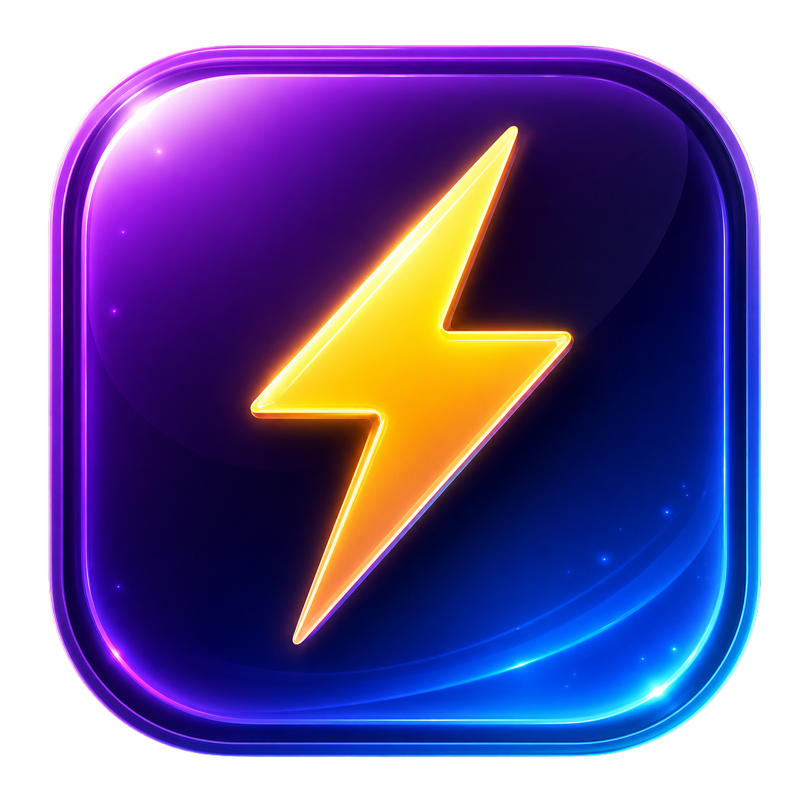
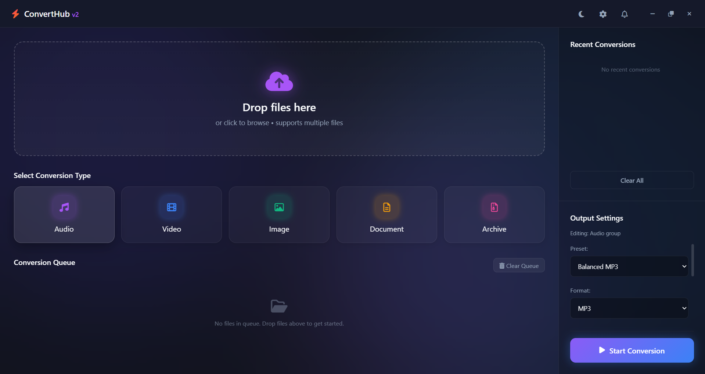

<p align="center">
  
</p>

# ⚡ ConvertHub v2

<p align="center">

  
  
  


</p>

<p align="center">
  <a href="https://github.com/PRIYANSHVERMA-droid/ConvertHub-v2/releases">
    
  </a>
</p>

---

## 🚀 Overview

**ConvertHub v2** is a modern desktop file converter focused on clean UI, curated formats, and efficient performance.

It integrates powerful engines:

- **FFmpeg** → audio & video conversion  
- **LibreOffice** → document conversion  
- **7-Zip** → archive handling  

All engines are bundled — no additional installation required.

---

## 🖥 Preview

<p align="center">
  
</p>

---

## ✨ Features

- ⚡ Smart format selection (no unnecessary clutter)  
- ⚡ Built-in conversion presets  
- ⚡ Drag & drop file support  
- ⚡ Conversion queue system  
- ⚡ Glassmorphism UI (Dark / Light mode)  
- ⚡ GPU-accelerated video encoding (NVENC / QSV supported)  
- ⚡ Optimized conversion pipeline  
- ⚡ Built-in engines (no external setup required)  

---

## 🎯 Supported Formats (Curated)

### 🎵 Audio
MP3, WAV, AAC, FLAC, OGG, WMA, M4A  

### 🎬 Video
MP4, AVI, MKV, MOV, WEBM, FLV, WMV  

### 🖼 Images
JPG, JPEG, PNG, WEBP, BMP, TIFF, ICO, GIF  

### 📄 Documents
PDF, DOCX, TXT, ODT, RTF, HTML, XLSX, PPTX  

### 📦 Archives
ZIP, 7Z, TAR, GZ  

---

## ⚡ Conversion Presets

### 🎵 Audio
- Balanced MP3  
- High Quality MP3  
- Lossless FLAC  

### 🎬 Video
- Balanced MP4  
- High Quality MP4  
- WebM (web optimized)  

### 🖼 Images
- JPEG Balanced  
- JPEG High Quality  
- PNG Lossless  
- WebP Optimized  

### 📄 Documents
- PDF Export  
- Word Editable  
- Plain Text  

### 📦 Archives
- ZIP (compatible)  
- 7Z (smaller size)  

---

## 🛠 Tech Stack

- **Electron** – Desktop framework  
- **Node.js** – Backend runtime  
- **FFmpeg** – Media conversion (GPU supported)  
- **LibreOffice** – Document conversion  
- **7-Zip** – Archive engine  

---

## 📦 Installation

1. Go to the **Releases** section  
2. Download the latest `.exe`  
3. Run installer  

👉 Download here:  
https://github.com/PRIYANSHVERMA-droid/ConvertHub-v2/releases  

---

## 📁 Project Structure

```
ConvertHub v2
│
├ assets
│   ├ screenshots
│   │   ├ icon.png
│   │   └ ui.png
│   └ app-icon.ico
│
├ core
│   └ conversionManager.js
│
├ Data
│   └ settings
│       ├ cache
│       ├ crash
│       ├ updates
│       └ user
│
├ dist
│   ├ win-unpacked
│   ├ builder-debug.yml
│   ├ builder-effective-config.yaml
│   ├ ConvertHub v2 Setup.exe
│   └ latest.yml
│
├ engines
│   ├ 7zip
│   │   ├ 7za.exe
│   │   └ 7za.dll
│   │
│   ├ libreoffice
│   │   ├ program
│   │   ├ presets
│   │   ├ share
│   │   └ URE
│   │
│   └ ffmpeg.exe
│
├ node_modules
│
├ ui
│   ├ app.js
│   ├ index.html
│   └ styles.css
│
├ main.js
├ preload.js
├ package.json
├ package-lock.json
│
├ README.md
├ LICENSE
├ .gitignore
└ .gitattributes
```


---

## ⚠️ Notes

- Optimized for **Windows**
- GPU acceleration depends on hardware support  
- Conversion speed varies based on file size, format, and system performance  
- Engines are bundled inside the app  
- Antivirus may flag binaries (false positives)  

---

## 🔮 Future Improvements

- Cross-platform support (Linux / macOS)  
- Advanced batch processing  
- Smarter GPU utilization  
- Auto-updater improvements  
- Performance tuning  

---

## 🤝 Contributing

1. Fork the repository  
2. Create a new branch  
3. Submit a pull request  

---

## 📜 License

This project is licensed under the **MIT License**.  
See the LICENSE file for details.
